# CIP Eventos - Backend API

API REST para el sistema de gestión de eventos del Colegio de Ingenieros del Perú (CIP).

## Novedades recientes

- Nuevo módulo de **Perfiles** (`/api/profiles/me`) para crear/consultar/actualizar/eliminar el perfil del usuario autenticado.
- Nuevo endpoint de **uploads** para avatares con URL firmada a MinIO/S3 (`/api/uploads/avatar-url`), guarda solo la URL en el perfil.
- **Módulo de Inscripciones (Registrations)**:
  - Soporte para inscripción de invitados (público) y miembros (autenticados).
  - Validación de stock y concurrencia con bloqueo pesimista.
  - Integración con servicio de validación CIP (simulado).
  - Rate limiting diferenciado (5 req/min para invitados, 15 req/min para miembros).
- Configuración rápida de MinIO local en `../bucket` (docker compose).

## Descripción

Backend desarrollado con NestJS que proporciona un sistema completo de autenticación, gestión de usuarios, roles y notificaciones por email para la plataforma de eventos del CIP.

## Características Principales

### 🔐 Autenticación y Seguridad

- Login/Register con JWT
- Tokens duales (access + refresh)
- Verificación de email con expiración (24h)
- Recuperación de contraseña con expiración (1h)
- Guards globales de protección
- Control de acceso basado en roles
- Hashing de contraseñas con bcrypt

### 👥 Gestión de Usuarios

- CRUD completo de usuarios
- Relación con roles
- Soft delete
- Campos de auditoría

### 🎭 Sistema de Roles

- CRUD completo de roles
- Roles por defecto: ADMIN, USER
- Validación de permisos

### 📧 Sistema de Emails

- Email de bienvenida con verificación
- Email de confirmación de cuenta
- Email de recuperación de contraseña
- Templates personalizables con Handlebars

## Tecnologías

- **Framework**: NestJS 11.x
- **Lenguaje**: TypeScript 5.7.3
- **Base de Datos**: PostgreSQL 16
- **ORM**: TypeORM 0.3.27
- **Autenticación**: Passport.js + JWT
- **Validación**: class-validator
- **Email**: @nestjs-modules/mailer + Nodemailer
- **Hashing**: bcrypt
- **Containerización**: Docker Compose

## Requisitos Previos

- Node.js >= 18
- pnpm >= 8
- PostgreSQL 16
- Docker & Docker Compose (opcional)

## Instalación

### 1. Clonar el repositorio

```bash
git clone https://github.com/carevalojesus/cip-eventos.git
cd cip-eventos/backend
```

### 2. Instalar dependencias

```bash
pnpm install
```

### 3. Configurar variables de entorno

Crea un archivo `.env` en la raíz del proyecto backend:

```bash
# Database
DB_HOST=localhost
DB_PORT=5432
DB_USERNAME=cip_eventos_user
DB_PASSWORD=CipEv3nt0s_2025!S3cur3
DB_NAME=cip_eventos

# JWT
JWT_SECRET=tu-clave-secreta-super-segura-aqui
JWT_EXPIRES_IN=15m
JWT_REFRESH_SECRET=tu-clave-refresh-super-segura-aqui
JWT_REFRESH_EXPIRES_IN=7d

# Email (Gmail)
MAIL_HOST=smtp.gmail.com
MAIL_PORT=587
MAIL_USER=tu-email@gmail.com
MAIL_PASSWORD=tu-app-password
MAIL_FROM=noreply@cipeventos.com

# Frontend
FRONTEND_URL=http://localhost:4321

# MinIO / S3 compatible (para uploads de avatar)
MINIO_ENDPOINT=http://localhost:9000
MINIO_REGION=us-east-1
MINIO_BUCKET=avatars
MINIO_ACCESS_KEY=minioadmin
MINIO_SECRET_KEY=supersecret
```

**Nota sobre Email:** Para Gmail, necesitas generar una "Contraseña de aplicación" en tu cuenta de Google (Configuración > Seguridad > Verificación en dos pasos > Contraseñas de aplicaciones).

### 4. Configurar la base de datos

#### Opción A: Con Docker Compose

```bash
docker-compose up -d
```

#### Opción B: PostgreSQL local

1. Crear la base de datos:

```sql
CREATE DATABASE cip_eventos;
CREATE USER cip_eventos_user WITH PASSWORD 'CipEv3nt0s_2025!S3cur3';
GRANT ALL PRIVILEGES ON DATABASE cip_eventos TO cip_eventos_user;
```

2. TypeORM creará automáticamente las tablas al iniciar la aplicación.

### 5. Ejecutar la aplicación

```bash
# Modo desarrollo
pnpm run start:dev

# Modo producción
pnpm run build
pnpm run start:prod
```

La API estará disponible en `http://localhost:3000`

### Prefijo global

Por defecto, todas las rutas están bajo `/api` (configurable con `API_PREFIX` en `.env`). Ejemplo: `POST /api/uploads/avatar-url`.

## Estructura del Proyecto

```
backend/
├── src/
│   ├── auth/              # Módulo de autenticación
│   │   ├── decorators/    # @Public, @Roles, @CurrentUser
│   │   ├── dto/           # DTOs de login, register, reset
│   │   ├── guards/        # JWT, Refresh, Roles, EmailVerified
│   │   ├── strategies/    # JWT y RefreshToken strategies
│   │   ├── auth.controller.ts
│   │   ├── auth.service.ts
│   │   └── auth.module.ts
│   ├── users/             # Módulo de usuarios
│   │   ├── dto/
│   │   ├── entities/
│   │   ├── users.controller.ts
│   │   ├── users.service.ts
│   │   └── users.module.ts
│   ├── roles/             # Módulo de roles
│   │   ├── dto/
│   │   ├── entities/
│   │   ├── roles.controller.ts
│   │   ├── roles.service.ts
│   │   └── roles.module.ts
│   ├── mail/              # Módulo de emails
│   │   ├── templates/     # Plantillas Handlebars
│   │   │   ├── welcome.hbs
│   │   │   ├── account-confirmed.hbs
│   │   │   └── reset-password.hbs
│   │   ├── mail.service.ts
│   │   └── mail.module.ts
│   ├── app.module.ts
│   └── main.ts
├── .env
├── docker-compose.yml
├── package.json
└── tsconfig.json
```

## API Endpoints

### Base URL

```
http://localhost:3000/api
```

### 📤 Uploads (requiere JWT)

1. Pedir URL firmada para avatar

```
POST /uploads/avatar-url
Content-Type: application/json
Authorization: Bearer <token>

{ "contentType": "image/png" }
```

Respuesta:

```json
{
  "uploadUrl": "http://localhost:9000/avatars/...",
  "publicUrl": "http://localhost:9000/avatars/...",
  "key": "avatars/uuid"
}
```

2. Subir la imagen a `uploadUrl` con PUT directo a MinIO (sin Authorization, solo `Content-Type` y el binario).

3. Guardar `publicUrl` en tu perfil:

```
PATCH /profiles/me
Authorization: Bearer <token>
Content-Type: application/json
{ "avatar": "<publicUrl>" }
```

### 🔓 Autenticación (Públicos)

#### 1. Registrar Usuario

```bash
POST /auth/register
Content-Type: application/json

{
  "email": "usuario@ejemplo.com",
  "password": "password123"
}
```

**Respuesta:**

```json
{
  "access_token": "eyJhbGciOiJIUzI1NiIsInR5cCI6IkpXVCJ9...",
  "refresh_token": "eyJhbGciOiJIUzI1NiIsInR5cCI6IkpXVCJ9..."
}
```

#### 2. Iniciar Sesión

```bash
POST /auth/login
Content-Type: application/json

{
  "email": "usuario@ejemplo.com",
  "password": "password123"
}
```

**Respuesta:**

```json
{
  "access_token": "eyJhbGciOiJIUzI1NiIsInR5cCI6IkpXVCJ9...",
  "refresh_token": "eyJhbGciOiJIUzI1NiIsInR5cCI6IkpXVCJ9...",
  "user": {
    "email": "usuario@ejemplo.com",
    "role": "USER"
  }
}
```

#### 3. Verificar Email

```bash
GET /auth/confirm?token=uuid-token-aqui
```

**Respuesta:**

```json
{
  "message": "Email verificado exitosamente"
}
```

#### 4. Reenviar Email de Verificación

```bash
POST /auth/resend-verification
Content-Type: application/json

{
  "email": "usuario@ejemplo.com"
}
```

#### 5. Solicitar Recuperación de Contraseña

```bash
POST /auth/forgot-password
Content-Type: application/json

{
  "email": "usuario@ejemplo.com"
}
```

#### 6. Restablecer Contraseña

```bash
POST /auth/reset-password?token=uuid-token-aqui
Content-Type: application/json

{
  "newPassword": "nuevaPassword123"
}
```

### 🔐 Autenticación (Protegidos)

#### 7. Renovar Tokens

```bash
POST /auth/refresh
Authorization: Bearer {refresh_token}
```

#### 8. Cerrar Sesión

```bash
POST /auth/logout
Authorization: Bearer {access_token}
```

### 👥 Usuarios (Requieren JWT)

#### 9. Listar Usuarios

```bash
GET /users
Authorization: Bearer {access_token}
```

#### 10. Obtener Usuario por ID

```bash
GET /users/{id}
Authorization: Bearer {access_token}
```

#### 11. Crear Usuario

```bash
POST /users
Authorization: Bearer {access_token}
Content-Type: application/json

{
  "email": "nuevo@ejemplo.com",
  "password": "password123",
  "roleId": "uuid-del-rol"
}
```

#### 12. Actualizar Usuario

```bash
PATCH /users/{id}
Authorization: Bearer {access_token}
Content-Type: application/json

{
  "email": "actualizado@ejemplo.com"
}
```

#### 13. Eliminar Usuario (Soft Delete)

```bash
DELETE /users/{id}
Authorization: Bearer {access_token}
```

### 🎭 Roles (Requieren JWT)

#### 14. Listar Roles

```bash
GET /roles
Authorization: Bearer {access_token}
```

#### 15. Obtener Rol por ID

```bash
GET /roles/{id}
Authorization: Bearer {access_token}
```

#### 16. Crear Rol

```bash
POST /roles
Authorization: Bearer {access_token}
Content-Type: application/json

{
  "name": "MODERADOR",
  "description": "Moderador de eventos"
}
```

#### 17. Actualizar Rol

````bash
PATCH /roles/{id}
Authorization: Bearer {access_token}
Content-Type: application/json

{
#### 18. Eliminar Rol (Soft Delete)

```bash
DELETE /roles/{id}
Authorization: Bearer {access_token}
````

### 🎫 Inscripciones (Registrations)

#### 19. Inscribir Invitado (Guest)

- **Rate Limit**: 5 peticiones por minuto por IP.
- **Nota**: Si el `cipCode` es proporcionado, se valida contra el servicio externo.

```bash
POST /registrations
Content-Type: application/json

{
  "ticketId": "uuid-del-ticket",
  "firstName": "Juan",
  "lastName": "Perez",
  "email": "juan.perez@email.com",
  "documentType": "DNI",
  "documentNumber": "12345678",
  "cipCode": "123456" // Opcional
}
```

#### 20. Inscribir Miembro (Autenticado)

- **Rate Limit**: 15 peticiones por minuto por usuario.
- **Nota**: Toma los datos del usuario autenticado. Si no tiene perfil de asistente, lo crea.

```bash
POST /registrations/member
Authorization: Bearer {access_token}
Content-Type: application/json

{
  "ticketId": "uuid-del-ticket"
}
```

#### 21. Listar Inscripciones (Admin/SuperAdmin)

```bash
GET /registrations
Authorization: Bearer {access_token}
```

#### 22. Obtener Inscripción por ID

```bash
GET /registrations/{id}
```

## Cómo Probar los Endpoints

### Opción 1: Con cURL

#### 1. Registrar un usuario

```bash
curl -X POST http://localhost:3000/api/auth/register \
  -H "Content-Type: application/json" \
  -d '{
    "email": "test@ejemplo.com",
    "password": "password123"
  }'
```

#### 2. Guardar el access_token

```bash
# Copia el access_token de la respuesta
export TOKEN="eyJhbGciOiJIUzI1NiIsInR5cCI6IkpXVCJ9..."
```

#### 3. Listar usuarios (con autenticación)

```bash
curl -X GET http://localhost:3000/api/users \
  -H "Authorization: Bearer $TOKEN"
```

### Opción 2: Con Postman

1. **Crear una colección** llamada "CIP Eventos API"

2. **Configurar Variables de Entorno:**
   - `base_url`: `http://localhost:3000/api`
   - `access_token`: (se actualizará automáticamente)

3. **Request de Login:**
   - Method: POST
   - URL: `{{base_url}}/auth/login`
   - Body (JSON):
     ```json
     {
       "email": "test@ejemplo.com",
       "password": "password123"
     }
     ```
   - Tests (para guardar el token):
     ```javascript
     const response = pm.response.json();
     pm.environment.set('access_token', response.access_token);
     ```

4. **Requests Protegidos:**
   - Agregar en Headers:
     - Key: `Authorization`
     - Value: `Bearer {{access_token}}`

### Opción 3: Con Thunder Client (VS Code)

1. Instalar extensión "Thunder Client"
2. Crear nueva request
3. Configurar similar a Postman
4. Usar variables de entorno

## Flujo de Autenticación

```mermaid
sequenceDiagram
    participant Usuario
    participant API
    participant DB
    participant Email

    Usuario->>API: POST /auth/register
    API->>DB: Crear usuario
    API->>DB: Guardar token verificación
    API->>Email: Enviar email bienvenida
    API->>Usuario: access_token + refresh_token

    Usuario->>Email: Click en link verificación
    Usuario->>API: GET /auth/confirm?token=xxx
    API->>DB: Validar token y expiración
    API->>DB: Marcar isVerified=true
    API->>Email: Enviar email confirmación
    API->>Usuario: Mensaje de éxito

    Usuario->>API: POST /auth/login
    API->>DB: Verificar credenciales
    API->>Usuario: access_token + refresh_token

    Usuario->>API: GET /users (con token)
    API->>API: Validar JWT
    API->>DB: Consultar usuarios
    API->>Usuario: Lista de usuarios
```



## Seguridad

### Tokens

- **Access Token**: Expira en 15 minutos
- **Refresh Token**: Expira en 7 días, hasheado en BD
- **Token Verificación**: Expira en 24 horas
- **Token Reset Password**: Expira en 1 hora

### Passwords

- Hasheados con bcrypt (10 salt rounds)
- Mínimo 6 caracteres (validación)

### Guards Implementados

- `JwtAuthGuard`: Protección global JWT
- `RefreshTokenGuard`: Validación de refresh tokens
- `RolesGuard`: Control de acceso por roles
- `EmailVerifiedGuard`: Requiere email verificado

### Decoradores Personalizados

- `@Public()`: Excluye ruta del guard global
- `@Roles('ADMIN', 'USER')`: Requiere roles específicos
- `@CurrentUser()`: Obtiene usuario del request

## Scripts Disponibles

```bash
# Desarrollo
pnpm run start:dev

# Producción
pnpm run build
pnpm run start:prod

# Linting
pnpm run lint

# Formateo
pnpm run format

# Tests
pnpm run test
pnpm run test:e2e
pnpm run test:cov
```

## Troubleshooting

### Error: No se pueden enviar emails

**Problema:** `Error: Invalid login: 535-5.7.8 Username and Password not accepted`

**Solución:**

1. Activa verificación en 2 pasos en Google
2. Genera una "Contraseña de aplicación"
3. Usa esa contraseña en `MAIL_PASSWORD`

### Error: Cannot connect to database

**Problema:** `ECONNREFUSED ::1:5432`

**Solución:**

1. Verifica que PostgreSQL esté corriendo: `docker ps` o `pg_isready`
2. Verifica las credenciales en `.env`
3. Si usas Docker: `docker-compose up -d`

### Error: Token expirado

**Problema:** `El token ha expirado`

**Solución:**

- Para verificación de email: Usar `POST /auth/resend-verification`
- Para reset de contraseña: Solicitar nuevo token con `POST /auth/forgot-password`

## Contribuir

1. Fork el proyecto
2. Crea una rama feature (`git checkout -b feature/nueva-funcionalidad`)
3. Commit tus cambios (`git commit -m 'feat: Agregar nueva funcionalidad'`)
4. Push a la rama (`git push origin feature/nueva-funcionalidad`)
5. Abre un Pull Request

## Licencia

Este proyecto es privado y pertenece al Colegio de Ingenieros del Perú.

## Autor

Christian Arévalo Jesús - [@carevalojesus](https://github.com/carevalojesus)

## Soporte

Para preguntas o soporte, contactar a: carevalojesus@gmail.com
